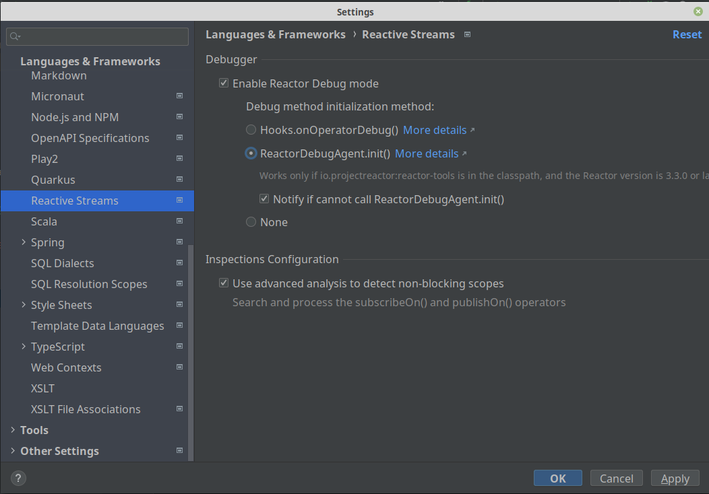

# Reative programming

Reative programming is different of reactive systems. Reactive programming focusing on computation through ephemeral dataflow chains—tend to be event-driven, while reactive systems—focusing on resilience and elasticity through the communication, and coordination, of distributed systems—is message-driven. Some concepts about reactive programming

- Event Driven: Publish and subscribe
- Data Streams: All works with data Streams
- Asynchronous
- Non-blocking
- Back pressure: when the progress of turning that input to output is resisted in some way. In most cases that resistance is computational speed or TPS Control. By the way, you might eventually hear someone use the word “backpressure” to actually mean something has the ability to control or handle backpressure.
- Functional/Declarative programming: different paradigm, pure functions, immutability, lambdas, etc  

### React in a cold or hot way
Observables (who publish events) can be cold or hot
- Cold: The lazy ones. Obervables only start publish events when anyone subscribe to this observable.
- Hot: The hard workers. Observables publish events, with or without subscribers. An example can be obervable who do lecture of temperature, that publish events every scheduled time.

### Initiative Reactive Streams
Is a definition and rules to define reactive programming. Reactive Streams is an initiative to provide a standard for asynchronous stream processing with non-blocking back pressure: 
- Process a pontentially unbounded number of elements
- Sequencially and asynchronously passing elements beetwen components
- And with mandatory non-blocking backpressure

In this definition, we have 4 interfaces:
- Publisher (or observable)
- Subscriber: Who read events
- Subscription: contract within publisher and subscriber - manage the backpressure
- Processor: Processing data state
https://www.reactive-streams.org/

Flow (Cold way):
- **Subcriber** subscribe on **publisher**
- Result of this, **subcription** is create.
- **Publisher** receive notification `onSubscribe` method.
- **Subscriber** requests N elements (_backpressure_) using **subscription**
- **Publisher** publish -> `onNext` method **subscriber**. This ends when:
  - **Publisher** send all the elements requested (defined by _backpressure_)
  - **Publisher** send all the elements it has. `onComplete` method to finish **subscriber** and **subscription**
  - There is an error -> `onError` method cancel **subscriber** and **subscription**


### Project Reator 
Implements reactive streams. We have others implementations, like Akka or rxJava2.
- Two composable APIs: Flux(number unbounded of elements) and Mono (one or zero elements).
- Good for microservice architecture, because Reactor offers backpressure-ready network engines for http.
- Huge range of operators, that allow us to select, filter, transform and combine streams.

https://projectreactor.io/


### Operators (RxJava)
When we have a flow of data, we have some kind of operators that we can use to do something with data before send to the subscriber, or to the next operator. We have the next types:

- Transforming Operators: transform the data and pass to next
  - buffer: https://rxmarbles.com/#buffer
  - flatMap: https://raw.github.com/wiki/ReactiveX/RMapOperatorxJava/images/rx-operators/flatMap.png 
  - groupBy: https://raw.github.com/wiki/ReactiveX/RxJava/images/rx-operators/groupBy.png
  - map: https://rxmarbles.com/#map
  - scan: https://rxmarbles.com/#scan
  - window
- Filtering Operators: filter stream data
  - Debounce: Observable wait a time until emit items.
  - Distinct: https://rxmarbles.com/#distinct
  - ElementAt
  - Filter: https://rxmarbles.com/#filter
  - First
  - IgnoreElements
  - Last
  - Sample
  - Skip: Ignore the first n elements
  - SkipLast: Ignore the last n elements
  - Take: Take the first n elements
  - TakeLast: Take the last n elements
- Combining Operators
  - combineLatest
  - merge
  - zip: https://rxmarbles.com/#zip
- Utility Operators
  - Delay: Delay to start emiting (only the first element)
  - do
  - Timestamp: Adding timestamp information on event
- Conditional Operators
  - all
  - contains
- Connectable Operators

To see marble diagram:
- https://rxmarbles.com
- http://reactivex.io/RxJava/javadoc/
- http://reactivex.io/RxJava/javadoc/io/reactivex/Flowable.html

## Spring webflux

Improve logs on intellij:


Spring do wrapper arround flux and mono objects. The subscribe process is doing on class ServerHttpHandlerAdapter (from package org.springframework.http.reactive)

Kotlin BlockHound:
- tricky: `implementation("io.projectreactor.kotlin:reactor-kotlin-extensions")`
```kotlin
    init {
        BlockHound.install(CoroutinesBlockHoundIntegration())
    }
```

For Kotlin, we have problems using bean validations' annotation `@Validated`. Is not supported with coroutines: https://github.com/spring-projects/spring-framework/issues/23152


### Next studies
- Functional controller
- Feign reactive


## Folders on repository
- [rxjava](rx-java): Project using RxJava based on [udemy course rxJava2](https://www.udemy.com/course/rxjava_2)
- [project-reator](project-reactor): Project using Reactor based on [DevDojo youtube course](https://www.youtube.com/playlist?list=PL62G310vn6nG3sBMCIEoZBK3r3E_4aKW5)
- [web-flux](web-flux): Project using WebFlux based on [DevDojo youtube course](https://www.youtube.com/watch?v=uLFU5Uou5t4&list=PL62G310vn6nH5Tgcp5q2a1xCb6CsZJAi7) 
- [web-flux-coroutines](web-flux-coroutines): Project with webflux using flow and coroutines

## References
- DevDojo: https://devdojo.academy/#Cursos
- Rx Java on udemy: https://www.udemy.com/course/rxjava_2
- Marble diagrams: https://rxmarbles.com
- Blog Spring about kotlin coroutines: https://spring.io/blog/2019/04/12/going-reactive-with-spring-coroutines-and-kotlin-flow
- Medium coroutines: https://medium.com/@tienisto/asynchronous-spring-using-kotlin-coroutines-and-r2dbc-93b3a079ac22
